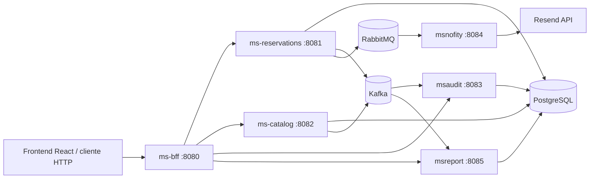
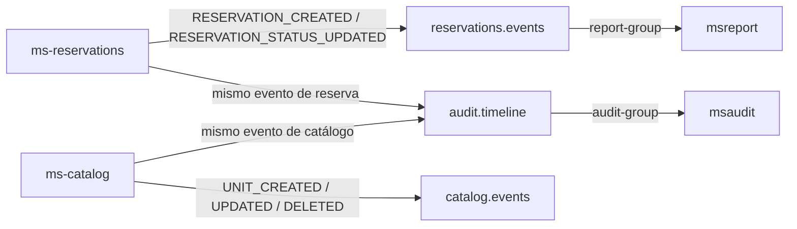

# AndesStay

Plataforma de gestión para una red de hostales, cabañas y lodges. El proyecto centraliza el catálogo de unidades, las reservas, las notificaciones, la auditoría de eventos y los indicadores operacionales mediante una arquitectura de microservicios Spring Boot.

> Este repositorio contiene principalmente el backend. La documentación original menciona un frontend React alojado en Azure y un AWS API Gateway, pero esos componentes no están incluidos en este workspace.

## Arquitectura



### Servicios

| Servicio | Puerto | Responsabilidad |
| --- | ---: | --- |
| `ms-bff` | `8080` | Entrada HTTP para el cliente, autenticación JWT y agregación/proxy hacia los microservicios. |
| `ms-reservations` | `8081` | Crea, consulta y actualiza reservas; valida disponibilidad; publica eventos y comandos. |
| `ms-catalog` | `8082` | Administra unidades, tipos de alojamiento, disponibilidad y datos del catálogo. |
| `msaudit` | `8083` | Consume eventos de auditoría desde Kafka y los persiste en `audit_events`. |
| `msnofity` | `8084` | Consume comandos RabbitMQ para email, housekeeping y vouchers. El nombre del módulo conserva la grafía actual `msnofity`. |
| `msreport` | `8085` | Consume eventos de reservas desde Kafka, los persiste y calcula KPIs. |
| PostgreSQL | `5433` externo / `5432` Docker | Base de datos compartida `andesstay_db`. |
| Kafka | `9092` externo / `29092` Docker | Event streaming para reservas, catálogo y auditoría. |
| RabbitMQ | `5672` | Mensajería de comandos; la consola de administración está en `15672`. |

Todos los servicios Java usan Maven y Spring Boot. Los Dockerfiles usan Eclipse Temurin 21 para ejecutar las aplicaciones.

## Flujo principal de una reserva

1. El cliente llama a `ms-bff` con un token JWT.
2. El BFF valida el token mediante el issuer configurado y reenvía la operación al microservicio correspondiente.
3. `ms-reservations` valida la unidad contra `ms-catalog` y persiste la reserva en PostgreSQL.
4. La reserva publica eventos Kafka en `reservations.events` y `audit.timeline`.
5. `msreport` consume `reservations.events` para alimentar reportes y KPIs.
6. `msaudit` consume `audit.timeline` y guarda la trazabilidad del actor, evento y agregado.
7. Al confirmar una reserva, `ms-reservations` publica comandos RabbitMQ para email, housekeeping y generación del voucher.
8. `msnofity` consume esos comandos y ejecuta la acción correspondiente.

Las transiciones a `CHECKIN_PENDIENTE` o `EN_ESTADIA` requieren que la reserva haya sido confirmada previamente. Las reservas canceladas son las únicas que pueden eliminarse.

## Kafka

Kafka es la plataforma de **event streaming** del proyecto. Se utiliza para publicar hechos que ya ocurrieron en el dominio, como una reserva creada, una reserva confirmada o una unidad actualizada. El productor no llama directamente al servicio consumidor: publica el evento en un topic y cada grupo de consumidores decide qué copia lógica recibe y cómo la procesa.

Esto lo diferencia de RabbitMQ:

| Tecnología | Uso en AndesStay | Ejemplo |
| --- | --- | --- |
| Kafka | Eventos de dominio, auditoría y reportes. Un mismo evento puede ser leído por varios grupos. | Una reserva se publica para `msreport` y, separadamente, para `msaudit`. |
| RabbitMQ | Comandos dirigidos a una acción concreta. | `ms-reservations` ordena enviar un email a `msnofity`. |

### Conceptos que se utilizan

- **Producer**: microservicio que publica eventos. Son `ms-reservations` y `ms-catalog`.
- **Topic**: canal lógico donde se almacenan los eventos. El proyecto usa `reservations.events`, `audit.timeline` y `catalog.events`.
- **Partition**: división de un topic que permite escalar el procesamiento. El código no fija particiones; Kafka administra la configuración del broker.
- **Key**: identificador usado al publicar. El proyecto usa `reservationId` o `unitId` como clave, para mantener relacionados los eventos de una misma entidad dentro de la partición correspondiente.
- **Consumer**: microservicio que lee eventos. Son `msreport` y `msaudit`.
- **Consumer group**: grupo que coordina consumidores y mantiene sus offsets. `report-group` y `audit-group` son independientes, por lo que ambos pueden recibir eventos sin competir entre sí.
- **Offset**: posición de lectura de un grupo dentro de cada partición. `auto-offset-reset=earliest` permite comenzar desde los eventos disponibles más antiguos cuando el grupo todavía no tiene offset.
- **Serialización JSON**: los productores envían el valor como JSON y los consumidores lo reciben como texto para luego interpretarlo.

### Topics

| Topic | Productor | Consumidor | Uso |
| --- | --- | --- | --- |
| `reservations.events` | `ms-reservations` | `msreport` (`report-group`) | Eventos `RESERVATION_CREATED` y `RESERVATION_STATUS_UPDATED`. |
| `audit.timeline` | `ms-reservations`, `ms-catalog` | `msaudit` (`audit-group`) | Auditoría de reservas y unidades. |
| `catalog.events` | `ms-catalog` | No se observa un consumidor en el código actual | Eventos `UNIT_CREATED`, `UNIT_UPDATED` y `UNIT_DELETED`. |

La topología funcional es:



Kafka no enruta por routing key como RabbitMQ: el productor elige el topic y Kafka conserva el evento para que cada grupo lo lea según sus offsets.

### Eventos publicados por `ms-reservations`

El método `publishReservationEvent(...)` construye un `Map<String, Object>` y lo envía dos veces, a dos topics diferentes, usando el ID de la reserva como clave:

| Evento | Topic | Consumidor | Cuándo se publica |
| --- | --- | --- | --- |
| `RESERVATION_CREATED` | `reservations.events` | `msreport` | Después de crear y guardar una reserva. |
| `RESERVATION_CREATED` | `audit.timeline` | `msaudit` | El mismo momento, para auditoría. |
| `RESERVATION_STATUS_UPDATED` | `reservations.events` | `msreport` | Después de cambiar el estado de una reserva. |
| `RESERVATION_STATUS_UPDATED` | `audit.timeline` | `msaudit` | El mismo momento, para conservar la trazabilidad. |

El payload de una reserva contiene:

```json
{
    "eventType": "RESERVATION_STATUS_UPDATED",
    "reservationId": 123,
    "unitId": 45,
    "guestId": 9,
    "status": "CONFIRMADA",
    "startDate": "2026-09-25",
    "endDate": "2026-09-28",
    "createdAt": "2026-09-23T10:00:00",
    "updatedAt": "2026-09-23T10:05:00",
    "actor": "usuario@ejemplo.com",
    "timestamp": 1710000000000
}
```

El método `publishReservationEvent(...)` está en [KafkaPublisher.java](backend/ms-reservations/src/main/java/com/andesstay/msreservations/messaging/KafkaPublisher.java). Se invoca desde `createReservation(...)` y `updateStatus(...)` en [ReservationService.java](backend/ms-reservations/src/main/java/com/andesstay/msreservations/service/ReservationService.java).

### Eventos publicados por `ms-catalog`

El método `publishUnitEvent(...)` publica los cambios de una unidad en `catalog.events` y también en `audit.timeline`:

| Evento | Topic | Consumidor actual | Cuándo se publica |
| --- | --- | --- | --- |
| `UNIT_CREATED` | `catalog.events` y `audit.timeline` | `catalog.events` no tiene consumidor; `audit.timeline` lo consume `msaudit` | Después de crear una unidad. |
| `UNIT_UPDATED` | `catalog.events` y `audit.timeline` | Igual que el anterior | Después de actualizar una unidad. |
| `UNIT_DELETED` | `catalog.events` y `audit.timeline` | Igual que el anterior | Después de eliminar una unidad. |

El payload de catálogo contiene `eventType`, `unitId`, `name`, `type`, `city`, `availability`, `actor` y `timestamp`. El productor está en [KafkaPublisher.java](backend/ms-catalog/src/main/java/com/andesstay/mscatalog/messaging/KafkaPublisher.java), y se invoca desde `create(...)`, `update(...)` y `delete(...)` en [CatalogService.java](backend/ms-catalog/src/main/java/com/andesstay/mscatalog/service/CatalogService.java).

### Cómo funciona el consumo

- `msaudit` escucha `audit.timeline` con el grupo `audit-group` mediante `consume(...)` en [AuditKafkaListener.java](backend/msaudit/listener/AuditKafkaListener.java). Convierte el texto JSON con `ObjectMapper`, identifica `eventType`, obtiene `reservationId` o `unitId` como agregado y delega en `saveEvent(...)` de [AuditService.java](backend/msaudit/service/AuditService.java), que persiste el evento en PostgreSQL.
- `msreport` escucha `reservations.events` con el grupo `report-group` mediante `consumeReservationEvent(...)` en [ReportEventListener.java](backend/msreport/listener/ReportEventListener.java). Guarda el JSON recibido como un `Report` en PostgreSQL.
- Los KPIs no se calculan directamente dentro del listener. [KpiService.java](backend/msreport/service/KpiService.java) lee los reportes guardados, filtra eventos de tipo `RESERVATION_EVENT` y calcula reservas por hora, ocupación activa y tiempo promedio del ciclo de reserva.
- `msaudit` define su `ConsumerFactory` y `kafkaListenerContainerFactory` en [KafkaConsumerConfig.java](backend/msaudit/config/KafkaConsumerConfig.java), con deserialización de clave y valor como `String`.
- Los grupos `audit-group` y `report-group` son distintos. Por eso `msaudit` y `msreport` reciben sus propios eventos: no se reparten el trabajo entre sí.

### Flujo Kafka de una reserva

| Paso | Qué ocurre | Método y archivo |
| --- | --- | --- |
| 1. Crear reserva | Se guarda la reserva en PostgreSQL y se construye el evento `RESERVATION_CREATED`. | `createReservation(...)` en [ReservationService.java](backend/ms-reservations/src/main/java/com/andesstay/msreservations/service/ReservationService.java) |
| 2. Publicar evento | Se envía el mismo evento a `reservations.events` y `audit.timeline` con `reservationId` como clave. | `publishReservationEvent(...)` en [KafkaPublisher.java](backend/ms-reservations/src/main/java/com/andesstay/msreservations/messaging/KafkaPublisher.java) |
| 3. Generar reporte | `msreport` recibe el evento con `report-group` y lo persiste como reporte. | `consumeReservationEvent(...)` en [ReportEventListener.java](backend/msreport/listener/ReportEventListener.java) |
| 4. Auditar | `msaudit` recibe la copia de `audit.timeline`, extrae el agregado y guarda el payload original. | `consume(...)` en [AuditKafkaListener.java](backend/msaudit/listener/AuditKafkaListener.java) y `saveEvent(...)` en [AuditService.java](backend/msaudit/service/AuditService.java) |
| 5. Cambiar estado | Al confirmar, cancelar o cambiar el estado, se crea `RESERVATION_STATUS_UPDATED` y se repite la publicación en ambos topics. | `updateStatus(...)` en [ReservationService.java](backend/ms-reservations/src/main/java/com/andesstay/msreservations/service/ReservationService.java) |
| 6. Calcular KPIs | Las consultas de reportes leen los eventos persistidos y calculan indicadores sobre el historial disponible. | `getKpis(...)`, `reservationsByHour(...)`, `activeOccupancy(...)` y `averageCycleTimeMinutes(...)` en [KpiService.java](backend/msreport/service/KpiService.java) |

### Configuración y ejecución

Los productores de `ms-reservations` y `ms-catalog` usan `KafkaTemplate<String, Object>` con JSON como serializador de valor. Sus propiedades principales son:

```properties
spring.kafka.bootstrap-servers=localhost:9092
spring.kafka.producer.key-serializer=org.apache.kafka.common.serialization.StringSerializer
spring.kafka.producer.value-serializer=org.springframework.kafka.support.serializer.JsonSerializer
```

Los consumidores de `msaudit` y `msreport` reciben el broker desde `KAFKA_HOST` y usan `localhost:9092` como valor local predeterminado:

```properties
spring.kafka.bootstrap-servers=${KAFKA_HOST:localhost:9092}
spring.kafka.consumer.auto-offset-reset=earliest
```

Los productores usan estas propiedades en [application.properties](backend/ms-reservations/src/main/resources/application.properties) y [application.properties](backend/ms-catalog/src/main/resources/application.properties). Los consumidores las usan en [application.properties](backend/msaudit/src/main/resources/application.properties) y [application.properties](backend/msreport/src/main/resources/application.properties).

En Docker, el broker se anuncia internamente como `kafka:29092` y externamente como `KAFKA_ADVERTISED_HOST:9092`. La definición se encuentra en [docker-compose.messaging.yml](docker-compose.messaging.yml). El contenedor utiliza un único nodo con rol `broker,controller`, replicación 1 y retención configurada de 24 horas o 1 GB. Estas opciones son adecuadas para desarrollo, pero no proporcionan alta disponibilidad de producción.

Para iniciar Kafka:

```powershell
docker compose -f docker-compose.messaging.yml up -d kafka
```

Para confirmar que los consumidores y productores estén conectados, revisar los logs de `msaudit`, `msreport`, `ms-reservations` y `ms-catalog`, además de la configuración de `KAFKA_HOST` en Docker.

## RabbitMQ

RabbitMQ es el broker de mensajería asíncrona utilizado para enviar **comandos de trabajo** entre microservicios. Un productor publica un mensaje y el broker decide a qué cola dirigirlo; el consumidor procesa el mensaje cuando está disponible. Esto desacopla la operación de reservas de tareas secundarias como enviar un email, crear una tarea de housekeeping o generar un voucher.

En este proyecto RabbitMQ no reemplaza a Kafka:

| Tecnología | Papel en AndesStay |
| --- | --- |
| RabbitMQ | Comandos dirigidos a una acción concreta y normalmente a un único consumidor lógico. |
| Kafka | Eventos de dominio y auditoría que pueden ser consumidos por varios grupos de consumidores. |

### Conceptos usados

- **Producer**: aplicación que publica el mensaje. En este caso, `ms-reservations`.
- **Exchange**: punto de entrada que recibe el mensaje y lo enruta; el productor no publica directamente en una cola.
- **Routing key**: clave que el exchange compara con los bindings para decidir la cola destino.
- **Queue**: almacenamiento temporal duradero del mensaje hasta que un consumidor lo procesa.
- **Consumer**: aplicación que escucha una cola. En este caso, `msnofity` mediante `@RabbitListener`.
- **Binding**: relación entre un exchange, una cola y una routing key.
- **DLX/DLQ**: dead-letter exchange y dead-letter queue; reciben mensajes que no pudieron procesarse.

### Topología real

El exchange principal es de tipo `direct`: la routing key debe coincidir exactamente con el binding de la cola. Las colas son durables, por lo que RabbitMQ conserva su definición y los mensajes pendientes ante un reinicio del broker, según las propiedades de entrega del mensaje.

| Exchange | Cola principal | Routing key | Consumidor | Acción |
| --- | --- | --- | --- | --- |
| `cmd.direct` | `q.cmd.email` | `email.send` | `msnofity` | Enviar email al huésped. |
| `cmd.direct` | `q.cmd.housekeeping` | `housekeeping.ticket` | `msnofity` | Crear ticket de preparación de habitación. |
| `cmd.direct` | `q.cmd.voucher` | `voucher.gen` | `msnofity` | Generar voucher de reserva. |
| `cmd.dead.dlx` | `q.cmd.email.dlq` | `q.cmd.email.dlq` | Sin consumidor de negocio | Mensajes fallidos de email. |
| `cmd.dead.dlx` | `q.cmd.housekeeping.dlq` | `q.cmd.housekeeping.dlq` | Sin consumidor de negocio | Mensajes fallidos de housekeeping. |
| `cmd.dead.dlx` | `q.cmd.voucher.dlq` | `q.cmd.voucher.dlq` | Sin consumidor de negocio | Mensajes fallidos de vouchers. |

Las colas principales tienen los argumentos `x-dead-letter-exchange=cmd.dead.dlx` y una routing key de dead letter con el sufijo `.dlq`. La topología se declara en `ms-reservations` y también en `msnofity`, lo que permite que cualquiera de los dos servicios declare los recursos al arrancar. Las definiciones deben mantenerse compatibles.

Aunque `ms-catalog` incluye `spring-boot-starter-amqp` y configuración de conexión, no tiene un productor, consumidor ni una configuración de colas RabbitMQ activa en el código actual. Por tanto, su relación actual con RabbitMQ es solo preparatoria.

### Flujo de una reserva

La siguiente trazabilidad muestra qué método participa en cada etapa y dónde se encuentra. Las rutas públicas pasan primero por el BFF; la lógica de negocio vive en `ms-reservations`; RabbitMQ se utiliza únicamente en los pasos marcados como comandos.

| Paso | Qué ocurre | Método y archivo |
| --- | --- | --- |
| 1. Entrada HTTP | El cliente crea una reserva mediante `POST /reservations`. El BFF valida el request y reenvía la petición a `POST /api/reservations`, incluyendo el actor en `X-Actor`. | `create(...)` en [ReservationBffController.java](backend/ms-bff/src/main/java/com/andesstay/msbff/controller/ReservationBffController.java) |
| 2. Controlador de reservas | El microservicio recibe la petición, obtiene el actor y delega la operación al servicio de reservas. | `createReservation(...)` en [ReservationController.java](backend/ms-reservations/src/main/java/com/andesstay/msreservations/controller/ReservationController.java) |
| 3. Validación de unidad | Se comprueba que la unidad exista y que esté disponible para las fechas solicitadas. | `createReservation(...)` en [ReservationService.java](backend/ms-reservations/src/main/java/com/andesstay/msreservations/service/ReservationService.java), que llama a `validateUnitAvailability(...)`, `getUnit(...)` y `checkAvailability(...)` en [UnitValidationService.java](backend/ms-reservations/src/main/java/com/andesstay/msreservations/service/UnitValidationService.java) |
| 4. Persistencia | Se calcula el total, se crea la entidad con estado `CREADA` y se guarda en PostgreSQL. | `createReservation(...)` y `reservationRepository.save(saved)` en [ReservationService.java](backend/ms-reservations/src/main/java/com/andesstay/msreservations/service/ReservationService.java) |
| 5. Email de registro opcional | Si `notifications.email.enabled=true`, se construye un comando `EMAIL_SEND`. Por defecto esta opción está desactivada. | `publishEmailCommand(...)` en [RabbitMQPublisher.java](backend/ms-reservations/src/main/java/com/andesstay/msreservations/messaging/RabbitMQPublisher.java), llamado desde `createReservation(...)` en [ReservationService.java](backend/ms-reservations/src/main/java/com/andesstay/msreservations/service/ReservationService.java) |
| 6. Evento de reserva | Después de guardar la reserva se publican los eventos `RESERVATION_CREATED` en Kafka para reportes y auditoría. | `publishReservationEvent(...)` en [KafkaPublisher.java](backend/ms-reservations/src/main/java/com/andesstay/msreservations/messaging/KafkaPublisher.java) |
| 7. Actualización de estado | Para confirmar la reserva, el cliente usa `PUT /reservations/{id}/status`; el BFF lo reenvía a `PUT /api/reservations/{id}/status`. | `updateStatus(...)` en [ReservationBffController.java](backend/ms-bff/src/main/java/com/andesstay/msbff/controller/ReservationBffController.java) y `updateStatus(...)` en [ReservationController.java](backend/ms-reservations/src/main/java/com/andesstay/msreservations/controller/ReservationController.java) |
| 8. Confirmación | Se valida la transición, se actualiza la entidad y se guarda el nuevo estado. Solo cuando `nextStatus == CONFIRMADA` se generan los comandos RabbitMQ. | `updateStatus(...)` y `reservationRepository.save(updated)` en [ReservationService.java](backend/ms-reservations/src/main/java/com/andesstay/msreservations/service/ReservationService.java) |
| 9. Comando de email | Si las notificaciones están habilitadas, se publica `EMAIL_SEND` con `email`, `subject` y `body`. | `publishEmailCommand(...)` en [RabbitMQPublisher.java](backend/ms-reservations/src/main/java/com/andesstay/msreservations/messaging/RabbitMQPublisher.java) |
| 10. Comando de housekeeping | Se publica `HOUSEKEEPING_TICKET` con `unitId` y `detail`, usando la routing key `housekeeping.ticket`. | `publishHousekeepingTicket(...)` en [RabbitMQPublisher.java](backend/ms-reservations/src/main/java/com/andesstay/msreservations/messaging/RabbitMQPublisher.java) |
| 11. Comando de voucher | Se publica `VOUCHER_GEN` con `reservationId`, `customerEmail`, `voucherCode` y `amount`, usando `voucher.gen`. | `publishVoucherGenCommand(...)` en [RabbitMQPublisher.java](backend/ms-reservations/src/main/java/com/andesstay/msreservations/messaging/RabbitMQPublisher.java) |
| 12. Enrutamiento RabbitMQ | `RabbitTemplate.convertAndSend()` envía el envoltorio JSON a `cmd.direct`; los bindings relacionan cada routing key con su cola. | `convertAndSend(...)` en [RabbitMQPublisher.java](backend/ms-reservations/src/main/java/com/andesstay/msreservations/messaging/RabbitMQPublisher.java) y bindings en [RabbitMQConfig.java](backend/ms-reservations/src/main/java/com/andesstay/msreservations/config/RabbitMQConfig.java) |
| 13. Consumo de email | `msnofity` escucha `q.cmd.email`, extrae `payload` y llama a Resend para enviar el correo. | `processEmail(...)` en [NotificationListener.java](backend/msnofity/listener/NotificationListener.java), que llama a `sendEmail(...)` en [NotificationService.java](backend/msnofity/service/NotificationService.java) |
| 14. Consumo de housekeeping | `msnofity` escucha `q.cmd.housekeeping`, transforma el payload y registra el ticket. | `processHousekeeping(...)` en [NotificationListener.java](backend/msnofity/listener/NotificationListener.java), que llama a `createTicket(...)` en [HousekeepingService.java](backend/msnofity/service/HousekeepingService.java) |
| 15. Consumo de voucher | `msnofity` escucha `q.cmd.voucher`, transforma el payload y registra la generación del voucher. | `processVoucher(...)` en [NotificationListener.java](backend/msnofity/listener/NotificationListener.java), que llama a `generateVoucher(...)` en [VoucherService.java](backend/msnofity/service/VoucherService.java) |
| 16. Error de consumo | Si el consumidor rechaza el mensaje, `default-requeue-rejected=false` evita el reintento automático y la configuración de la cola permite enviarlo al dead-letter exchange. | Propiedad en [application.properties](backend/msnofity/src/main/resources/application.properties) y argumentos de cola en [RabbitMQConfig.java](backend/msnofity/config/RabbitMQConfig.java) |

#### Resumen por escenario

**Crear una reserva (`POST /reservations`)**

`ReservationBffController.create(...)` -> `ReservationController.createReservation(...)` -> `ReservationService.createReservation(...)` -> `UnitValidationService.validateUnitAvailability(...)` -> `reservationRepository.save(...)` -> opcionalmente `RabbitMQPublisher.publishEmailCommand(...)` -> `KafkaPublisher.publishReservationEvent(...)`.

**Confirmar una reserva (`PUT /reservations/{id}/status` con `CONFIRMADA`)**

`ReservationBffController.updateStatus(...)` -> `ReservationController.updateStatus(...)` -> `ReservationService.updateStatus(...)` -> `reservationRepository.save(...)` -> `RabbitMQPublisher.publishEmailCommand(...)` opcional -> `RabbitMQPublisher.publishHousekeepingTicket(...)` -> `RabbitMQPublisher.publishVoucherGenCommand(...)` -> `KafkaPublisher.publishReservationEvent(...)`.

**Procesar los comandos**

RabbitMQ enruta cada mensaje según su routing key y `NotificationListener` recibe el comando. Después delega en `NotificationService`, `HousekeepingService` o `VoucherService`. Actualmente, email sí intenta una integración externa con Resend; housekeeping y voucher solo registran la operación en los logs.

### Formato de los mensajes

Todos los comandos usan un envoltorio JSON con estos campos:

```json
{
    "eventId": "identificador-unico",
    "type": "HOUSEKEEPING_TICKET",
    "timestamp": 1710000000000,
    "traceId": "traza-unica",
    "correlationId": "RES-123",
    "payload": {}
}
```

`eventId` y `timestamp` se generan por defecto en `ms-reservations`; `traceId` identifica la publicación y `correlationId` relaciona el comando con la reserva. El contenido de `payload` depende del comando:

| `type` | Payload principal | Resultado actual en `msnofity` |
| --- | --- | --- |
| `EMAIL_SEND` | `email`, `subject`, `body` | Llama a Resend mediante `https://api.resend.com/emails`. |
| `HOUSEKEEPING_TICKET` | `unitId`, `detail` | Registra el ticket en los logs; aún no lo persiste ni lo envía a otro servicio. |
| `VOUCHER_GEN` | `reservationId`, `customerEmail`, `voucherCode`, `amount` | Registra la generación en los logs; aún no crea un voucher persistente. |

El consumidor de email también contempla el tipo `WEBPUSH`, pero actualmente solo lo registra en logs y el productor de reservas no publica ese comando.

### Microservicios y código relacionado

- `backend/ms-reservations`: dependencia `spring-boot-starter-amqp`, configuración de exchanges/colas/bindings en `RabbitMQConfig` y publicación en `RabbitMQPublisher`. `ReservationService` decide cuándo publicar.
- `backend/msnofity`: conexión al broker en `application.properties`, declaración de la topología y consumo en `NotificationListener`. Los servicios `NotificationService`, `HousekeepingService` y `VoucherService` ejecutan las acciones.
- `backend/ms-catalog`: tiene la dependencia AMQP y propiedades de conexión, pero actualmente no usa RabbitMQ funcionalmente.
- `docker-compose.messaging.yml`: inicia el broker con la imagen `rabbitmq:3-management`.
- `docker-compose.yml`: conecta `ms-reservations` y `msnofity` con el hostname Docker `rabbitmq`.

### Configuración y ejecución

RabbitMQ se ejecuta como contenedor con:

| Parámetro | Valor Docker | Valor local predeterminado |
| --- | --- | --- |
| Host | `rabbitmq` | `localhost` |
| Puerto AMQP | `5672` | `5672` |
| Usuario | `guest` | `guest` |
| Contraseña | `guest` | `guest` |
| Consola de administración | `http://localhost:15672` | `guest` / `guest` |

Para levantarlo junto con Kafka:

```powershell
docker compose -f docker-compose.messaging.yml up -d
```

Para levantar la aplicación completa, ejecutar después:

```powershell
docker compose up -d --build
```

En Docker, `ms-reservations` usa `SPRING_RABBITMQ_HOST=rabbitmq` y `SPRING_RABBITMQ_PORT=5672`; `msnofity` usa `RABBITMQ_HOST=rabbitmq`, `RABBITMQ_PORT=5672`, `RABBITMQ_USER` y `RABBITMQ_PASSWORD`. Ejecutando los servicios fuera de Docker, la conexión local usa `localhost:5672`.

### Verificación y diagnóstico

1. Abrir `http://localhost:15672` y revisar que existan `cmd.direct`, las tres colas principales y las DLQ.
2. Crear una reserva y comprobar que `ms-reservations` registra la publicación solo si corresponde al estado/configuración.
3. Confirmar una reserva y revisar los logs de `msnofity` para las rutas `q.cmd.housekeeping` y `q.cmd.voucher`.
4. Si el email está habilitado, configurar `RESEND_API_KEY` y `RESEND_FROM_EMAIL`; sin esas variables el consumo del email puede fallar.
5. Revisar las DLQ si una cola principal acumula mensajes o si un consumidor rechaza el procesamiento.

RabbitMQ no garantiza por sí mismo que una operación de negocio y su publicación sean atómicas: la reserva se guarda en PostgreSQL y el comando se publica después desde la misma lógica de servicio. Para producción convendría evaluar confirmaciones del publisher, reintentos controlados, consumidores idempotentes y un patrón outbox.

## API expuesta por el BFF

Todas las rutas del BFF requieren autenticación, salvo que la configuración de seguridad se modifique.

### Reservas

| Método | Ruta | Descripción |
| --- | --- | --- |
| `POST` | `/reservations` | Crear una reserva. |
| `GET` | `/reservations` | Listar reservas; admite `status`, `from` y `to`. |
| `GET` | `/reservations/{id}` | Obtener una reserva. |
| `GET` | `/reservations/by-unit/{unitId}` | Listar reservas de una unidad. |
| `PUT` | `/reservations/{id}/status` | Actualizar el estado. |
| `DELETE` | `/reservations/{id}` | Eliminar una reserva cancelada. |

### Catálogo

| Método | Ruta | Descripción |
| --- | --- | --- |
| `POST` | `/api/units` | Crear una unidad. |
| `GET` | `/api/units` | Listar unidades; admite `type` y `availability`. |
| `GET` | `/api/units/{id}` | Obtener una unidad. |
| `GET` | `/api/units/{id}/availability` | Consultar disponibilidad con `from` y `to`. |
| `PUT` | `/api/units/{id}` | Actualizar una unidad. |
| `DELETE` | `/api/units/{id}` | Eliminar una unidad. |

### Auditoría, reportes y usuario

| Método | Ruta | Descripción |
| --- | --- | --- |
| `GET` | `/audit` | Listar eventos de auditoría. |
| `GET` | `/audit/timeline/{aggregateId}` | Consultar la línea temporal de un agregado. |
| `GET` | `/reports` | Listar reportes almacenados. |
| `GET` | `/reports/kpis` | Obtener todos los KPIs. |
| `GET` | `/reports/kpis/reservations-by-hour` | Reservas agrupadas por hora. |
| `GET` | `/reports/kpis/active-occupancy` | Ocupación activa, basada en reservas `EN_ESTADIA`. |
| `GET` | `/reports/kpis/cycle-time` | Tiempo promedio entre creación y confirmación. |
| `GET` | `/api/users/me` | Obtener los datos del usuario autenticado. |

## Requisitos

- Docker Desktop con Docker Compose.
- Para ejecutar servicios fuera de Docker: JDK 17 o superior y Maven Wrapper.
- Una cuenta y API key de Resend si se desean enviar emails reales.
- Un host anunciado accesible para Kafka cuando se conecten clientes externos al contenedor.

## Configuración

El archivo `.env` de ejemplo del repositorio contiene:

```dotenv
KAFKA_HOST=kafka:29092
RABBITMQ_HOST=rabbitmq
RABBITMQ_PORT=5672
KAFKA_ADVERTISED_HOST=172.31.26.215
```

`KAFKA_ADVERTISED_HOST` debe cambiarse por la IP o DNS que usarán los clientes externos. No se debe publicar una credencial real en el repositorio. Para email, agregar por ejemplo:

```dotenv
RESEND_API_KEY=tu_api_key
RESEND_FROM_EMAIL=onboarding@resend.dev
```

Las configuraciones locales de los servicios usan PostgreSQL en `localhost:5433`, Kafka en `localhost:9092` y RabbitMQ en `localhost:5672`. Dentro de Compose, los servicios usan los nombres DNS de los contenedores.

## Ejecución con Docker Compose

Desde la raíz del repositorio:

```powershell
docker compose -f docker-compose.messaging.yml up -d
docker compose up -d --build
```

Comprobar el estado:

```powershell
docker compose -f docker-compose.messaging.yml ps
docker compose ps
```

URLs útiles:

- BFF: `http://localhost:8080`
- RabbitMQ Management: `http://localhost:15672` (`guest` / `guest`)
- PostgreSQL: `localhost:5433`
- Kafka externo: `localhost:9092`

Para detener la aplicación:

```powershell
docker compose down
docker compose -f docker-compose.messaging.yml down
```

Para conservar o eliminar los datos de PostgreSQL, recordar que `postgres_data` es un volumen de Docker. `docker compose down -v` lo elimina.

## Wizard de despliegue del backend

El wizard de línea de comandos está en [`scripts/deploy-backend.ps1`](scripts/deploy-backend.ps1). Permite seleccionar:

- `Local`: valida Docker Compose y puede levantar mensajería y todos los microservicios.
- `AWS`: valida AWS CLI, Docker y la identidad activa antes de preparar el despliegue hacia ECR/ECS.
- `Azure`: valida Azure CLI, Docker y la suscripción activa antes de preparar el despliegue hacia ACR/Container Apps.

Para abrir el wizard en Windows:

```powershell
powershell -ExecutionPolicy Bypass -File .\scripts\deploy-backend.ps1
```

Al seleccionar `1. Local`, el wizard ejecuta automáticamente los dos comandos de Docker Compose. Para revisar los comandos sin ejecutarlos:

```powershell
powershell -ExecutionPolicy Bypass -File .\scripts\deploy-backend.ps1 -WhatIf
```

AWS y Azure requieren definir previamente la red, secretos, registro de imágenes, permisos y sizing del entorno. Por eso el wizard valida las herramientas y muestra el siguiente paso sin ejecutar comandos cloud irreversibles automáticamente. Las credenciales deben permanecer en el entorno local o en el proveedor cloud, nunca en el frontend ni en el repositorio.

### Contrato para el frontend externo

El `ms-bff` expone los endpoints autenticados:

- `GET /api/deployments/options`: destinos disponibles y si requieren credenciales cloud.
- `POST /api/deployments/plan`: genera un plan y los comandos del wizard.

Ejemplo de solicitud:

```json
{
  "target": "AWS",
  "projectName": "andesstay",
  "awsRegion": "us-east-1"
}
```

Para Azure, usar `azureResourceGroup` y `azureLocation`. El BFF no ejecuta comandos del sistema ni recibe credenciales; el frontend debe mostrar el plan y dirigir al operador al wizard CLI.

## Ejecución local de un servicio

Primero levantar las dependencias de mensajería y PostgreSQL:

```powershell
docker compose -f docker-compose.messaging.yml up -d
# PostgreSQL también puede levantarse con el compose principal:
docker compose up -d postgres-db
```

Después, desde el directorio de cada microservicio:

```powershell
cd backend/ms-bff
./mvnw.cmd spring-boot:run
```

En PowerShell, repetir el patrón cambiando el directorio por `ms-catalog`, `ms-reservations`, `msaudit`, `msnofity` o `msreport`. Los puertos son los indicados en la tabla de servicios.

## Estructura del repositorio

```text
.
├── backend/
│   ├── ms-bff/             # API Gateway/BFF reactivo
│   ├── ms-catalog/         # Catálogo de unidades
│   ├── ms-reservations/    # Reservas y publicación de eventos/comandos
│   ├── msaudit/            # Auditoría Kafka
│   ├── msnofity/           # Consumidores RabbitMQ y notificaciones
│   └── msreport/           # Reportes y KPIs Kafka
├── docs/
│   └── Arquitectura.MD
├── docker-compose.yml
├── docker-compose.messaging.yml
└── .env
```

## Observaciones del estado actual

- El BFF está preparado para proteger las rutas con JWT de Microsoft Entra External ID/Azure AD.
- El código incluye referencias a un frontend React y a un API Gateway de AWS en la documentación funcional, pero no hay código de frontend ni configuración de API Gateway en este repositorio.
- `catalog.events` tiene productor, pero no se encontró un consumidor activo en el backend.
- `msreport` almacena los eventos recibidos y calcula KPIs a partir de ellos; no es un motor de analítica externa.
- Housekeeping, web push y voucher están implementados como puntos de integración/logging, no como flujos persistidos completos.
- Conviene revisar los nombres de dead-letter routing keys de `ms-reservations` y `msnofity` antes de usar DLQ en producción, porque parte de esa topología se declara en ambos servicios.

## Desarrollo y pruebas

Cada módulo Maven tiene su propio `pom.xml`, wrapper Maven y carpeta `src/test`. Para ejecutar las pruebas de un módulo:

```powershell
cd backend/ms-reservations
./mvnw.cmd test
```

Cambiar `ms-reservations` por el módulo que se quiera validar.
