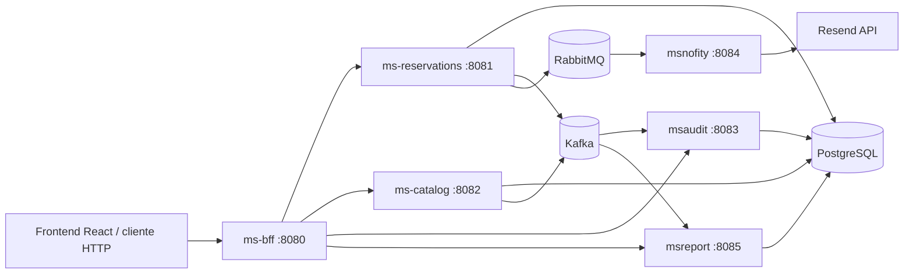

# AndesStay

Plataforma de gestión para una red de hostales, cabañas y lodges. El proyecto centraliza el catálogo de unidades, las reservas, las notificaciones, la auditoría de eventos y los indicadores operacionales mediante una arquitectura de microservicios Spring Boot.

> Este repositorio contiene principalmente el backend. La documentación original menciona un frontend React alojado en Azure y un AWS API Gateway, pero esos componentes no están incluidos en este workspace.

## Arquitectura



### Servicios

| Servicio | Puerto | Responsabilidad |
| --- | ---: | --- |
| `ms-bff` | `8080` | Entrada HTTP para el cliente, autenticación JWT y agregación/proxy hacia los microservicios. |
| `ms-reservations` | `8081` | Crea, consulta y actualiza reservas; valida disponibilidad; publica eventos y comandos. |
| `ms-catalog` | `8082` | Administra unidades, tipos de alojamiento, disponibilidad y datos del catálogo. |
| `msaudit` | `8083` | Consume eventos de auditoría desde Kafka y los persiste en `audit_events`. |
| `msnofity` | `8084` | Consume comandos RabbitMQ para email, housekeeping y vouchers. El nombre del módulo conserva la grafía actual `msnofity`. |
| `msreport` | `8085` | Consume eventos de reservas desde Kafka, los persiste y calcula KPIs. |
| PostgreSQL | `5433` externo / `5432` Docker | Base de datos compartida `andesstay_db`. |
| Kafka | `9092` externo / `29092` Docker | Event streaming para reservas, catálogo y auditoría. |
| RabbitMQ | `5672` | Mensajería de comandos; la consola de administración está en `15672`. |

Todos los servicios Java usan Maven y Spring Boot. Los Dockerfiles usan Eclipse Temurin 21 para ejecutar las aplicaciones.

## Flujo principal de una reserva

1. El cliente llama a `ms-bff` con un token JWT.
2. El BFF valida el token mediante el issuer configurado y reenvía la operación al microservicio correspondiente.
3. `ms-reservations` valida la unidad contra `ms-catalog` y persiste la reserva en PostgreSQL.
4. La reserva publica eventos Kafka en `reservations.events` y `audit.timeline`.
5. `msreport` consume `reservations.events` para alimentar reportes y KPIs.
6. `msaudit` consume `audit.timeline` y guarda la trazabilidad del actor, evento y agregado.
7. Al confirmar una reserva, `ms-reservations` publica comandos RabbitMQ para email, housekeeping y generación del voucher.
8. `msnofity` consume esos comandos y ejecuta la acción correspondiente.

Las transiciones a `CHECKIN_PENDIENTE` o `EN_ESTADIA` requieren que la reserva haya sido confirmada previamente. Las reservas canceladas son las únicas que pueden eliminarse.

## Kafka

Kafka se utiliza para eventos de dominio que pueden ser consumidos por varios servicios de forma independiente. Los productores serializan el valor como JSON y usan el identificador de la entidad como clave.

### Topics

| Topic | Productor | Consumidor | Uso |
| --- | --- | --- | --- |
| `reservations.events` | `ms-reservations` | `msreport` (`report-group`) | Eventos `RESERVATION_CREATED` y `RESERVATION_STATUS_UPDATED`. |
| `audit.timeline` | `ms-reservations`, `ms-catalog` | `msaudit` (`audit-group`) | Auditoría de reservas y unidades. |
| `catalog.events` | `ms-catalog` | No se observa un consumidor en el código actual | Eventos `UNIT_CREATED`, `UNIT_UPDATED` y `UNIT_DELETED`. |

Un evento de reserva contiene, entre otros campos, `eventType`, `reservationId`, `unitId`, `guestId`, `status`, fechas, `actor` y `timestamp`. Un evento de catálogo contiene `eventType`, `unitId`, nombre, tipo, ciudad, disponibilidad, actor y timestamp.

### Cómo funciona el consumo

- `msaudit` escucha `audit.timeline` con el grupo `audit-group`, interpreta el JSON y guarda el payload completo.
- `msreport` escucha `reservations.events` con el grupo `report-group` y guarda cada evento para calcular sus indicadores.
- Los grupos de consumidores permiten que auditoría y reportes reciban sus propias copias lógicas de los eventos.
- El broker local se ejecuta como un nodo Kafka combinado broker/controller, con replicación 1 y retención configurada de 24 horas o 1 GB.

## RabbitMQ

RabbitMQ se utiliza para comandos dirigidos a una acción concreta. `ms-reservations` publica mensajes JSON en el exchange directo `cmd.direct`; `msnofity` los consume desde colas durables.

### Exchanges y colas

| Exchange | Cola | Routing key | Acción |
| --- | --- | --- | --- |
| `cmd.direct` | `q.cmd.email` | `email.send` | Enviar email al huésped. |
| `cmd.direct` | `q.cmd.housekeeping` | `housekeeping.ticket` | Crear ticket de preparación de habitación. |
| `cmd.direct` | `q.cmd.voucher` | `voucher.gen` | Generar voucher de reserva. |
| `cmd.dlx` | `q.cmd.email.dlq` | `q.cmd.email.dlq` | Mensajes fallidos de email. |
| `cmd.dlx` | `q.cmd.housekeeping.dlq` | `housekeeping.ticket.dlq` | Mensajes fallidos de housekeeping. |
| `cmd.dlx` | `q.cmd.voucher.dlq` | `q.cmd.voucher.dlq` | Mensajes fallidos de vouchers. |

También se declara el exchange `cmd.topic` y bindings alternativos en `msnofity` (`email.*`, `housekeeping.#` y `voucher.*`), aunque el publicador actual usa `cmd.direct`.

Cada comando lleva un envoltorio con `type`, `traceId`, `correlationId` y `payload`. Por ejemplo, un email contiene `email`, `subject` y `body`; un ticket contiene `unitId` y `detail`; y un voucher contiene `reservationId`.

Cuando una reserva pasa a `CONFIRMADA`, se envían los comandos de housekeeping y voucher. El email de confirmación también se envía si `notifications.email.enabled=true`. Al crear una reserva, el email de registro está deshabilitado por defecto.

`msnofity` configura `default-requeue-rejected=false`: un mensaje rechazado no se reintenta automáticamente y puede terminar en su dead-letter queue según la configuración del broker.

### Acciones actuales de `msnofity`

- Email: llama a `https://api.resend.com/emails` usando `RESEND_API_KEY` y `RESEND_FROM_EMAIL`.
- Web push: solo registra el evento en logs; no hay proveedor externo configurado.
- Housekeeping: solo registra el ticket; el código deja pendiente persistirlo o enviarlo a otro servicio.
- Voucher: solo registra la generación; no se crea aún un archivo, código persistente ni envío al huésped.

## API expuesta por el BFF

Todas las rutas del BFF requieren autenticación, salvo que la configuración de seguridad se modifique.

### Reservas

| Método | Ruta | Descripción |
| --- | --- | --- |
| `POST` | `/reservations` | Crear una reserva. |
| `GET` | `/reservations` | Listar reservas; admite `status`, `from` y `to`. |
| `GET` | `/reservations/{id}` | Obtener una reserva. |
| `GET` | `/reservations/by-unit/{unitId}` | Listar reservas de una unidad. |
| `PUT` | `/reservations/{id}/status` | Actualizar el estado. |
| `DELETE` | `/reservations/{id}` | Eliminar una reserva cancelada. |

### Catálogo

| Método | Ruta | Descripción |
| --- | --- | --- |
| `POST` | `/api/units` | Crear una unidad. |
| `GET` | `/api/units` | Listar unidades; admite `type` y `availability`. |
| `GET` | `/api/units/{id}` | Obtener una unidad. |
| `GET` | `/api/units/{id}/availability` | Consultar disponibilidad con `from` y `to`. |
| `PUT` | `/api/units/{id}` | Actualizar una unidad. |
| `DELETE` | `/api/units/{id}` | Eliminar una unidad. |

### Auditoría, reportes y usuario

| Método | Ruta | Descripción |
| --- | --- | --- |
| `GET` | `/audit` | Listar eventos de auditoría. |
| `GET` | `/audit/timeline/{aggregateId}` | Consultar la línea temporal de un agregado. |
| `GET` | `/reports` | Listar reportes almacenados. |
| `GET` | `/reports/kpis` | Obtener todos los KPIs. |
| `GET` | `/reports/kpis/reservations-by-hour` | Reservas agrupadas por hora. |
| `GET` | `/reports/kpis/active-occupancy` | Ocupación activa, basada en reservas `EN_ESTADIA`. |
| `GET` | `/reports/kpis/cycle-time` | Tiempo promedio entre creación y confirmación. |
| `GET` | `/api/users/me` | Obtener los datos del usuario autenticado. |

## Requisitos

- Docker Desktop con Docker Compose.
- Para ejecutar servicios fuera de Docker: JDK 17 o superior y Maven Wrapper.
- Una cuenta y API key de Resend si se desean enviar emails reales.
- Un host anunciado accesible para Kafka cuando se conecten clientes externos al contenedor.

## Configuración

El archivo `.env` de ejemplo del repositorio contiene:

```dotenv
KAFKA_HOST=kafka:29092
RABBITMQ_HOST=rabbitmq
RABBITMQ_PORT=5672
KAFKA_ADVERTISED_HOST=172.31.26.215
```

`KAFKA_ADVERTISED_HOST` debe cambiarse por la IP o DNS que usarán los clientes externos. No se debe publicar una credencial real en el repositorio. Para email, agregar por ejemplo:

```dotenv
RESEND_API_KEY=tu_api_key
RESEND_FROM_EMAIL=onboarding@resend.dev
```

Las configuraciones locales de los servicios usan PostgreSQL en `localhost:5433`, Kafka en `localhost:9092` y RabbitMQ en `localhost:5672`. Dentro de Compose, los servicios usan los nombres DNS de los contenedores.

## Ejecución con Docker Compose

Desde la raíz del repositorio:

```powershell
docker compose -f docker-compose.messaging.yml up -d
docker compose up -d --build
```

Comprobar el estado:

```powershell
docker compose -f docker-compose.messaging.yml ps
docker compose ps
```

URLs útiles:

- BFF: `http://localhost:8080`
- RabbitMQ Management: `http://localhost:15672` (`guest` / `guest`)
- PostgreSQL: `localhost:5433`
- Kafka externo: `localhost:9092`

Para detener la aplicación:

```powershell
docker compose down
docker compose -f docker-compose.messaging.yml down
```

Para conservar o eliminar los datos de PostgreSQL, recordar que `postgres_data` es un volumen de Docker. `docker compose down -v` lo elimina.

## Ejecución local de un servicio

Primero levantar las dependencias de mensajería y PostgreSQL:

```powershell
docker compose -f docker-compose.messaging.yml up -d
# PostgreSQL también puede levantarse con el compose principal:
docker compose up -d postgres-db
```

Después, desde el directorio de cada microservicio:

```powershell
cd backend/ms-bff
./mvnw.cmd spring-boot:run
```

En PowerShell, repetir el patrón cambiando el directorio por `ms-catalog`, `ms-reservations`, `msaudit`, `msnofity` o `msreport`. Los puertos son los indicados en la tabla de servicios.

## Estructura del repositorio

```text
.
├── backend/
│   ├── ms-bff/             # API Gateway/BFF reactivo
│   ├── ms-catalog/         # Catálogo de unidades
│   ├── ms-reservations/    # Reservas y publicación de eventos/comandos
│   ├── msaudit/            # Auditoría Kafka
│   ├── msnofity/           # Consumidores RabbitMQ y notificaciones
│   └── msreport/           # Reportes y KPIs Kafka
├── docs/
│   └── Arquitectura.MD
├── docker-compose.yml
├── docker-compose.messaging.yml
└── .env
```

## Observaciones del estado actual

- El BFF está preparado para proteger las rutas con JWT de Microsoft Entra External ID/Azure AD.
- El código incluye referencias a un frontend React y a un API Gateway de AWS en la documentación funcional, pero no hay código de frontend ni configuración de API Gateway en este repositorio.
- `catalog.events` tiene productor, pero no se encontró un consumidor activo en el backend.
- `msreport` almacena los eventos recibidos y calcula KPIs a partir de ellos; no es un motor de analítica externa.
- Housekeeping, web push y voucher están implementados como puntos de integración/logging, no como flujos persistidos completos.
- Conviene revisar los nombres de dead-letter routing keys de `ms-reservations` y `msnofity` antes de usar DLQ en producción, porque parte de esa topología se declara en ambos servicios.

## Desarrollo y pruebas

Cada módulo Maven tiene su propio `pom.xml`, wrapper Maven y carpeta `src/test`. Para ejecutar las pruebas de un módulo:

```powershell
cd backend/ms-reservations
./mvnw.cmd test
```

Cambiar `ms-reservations` por el módulo que se quiera validar.
