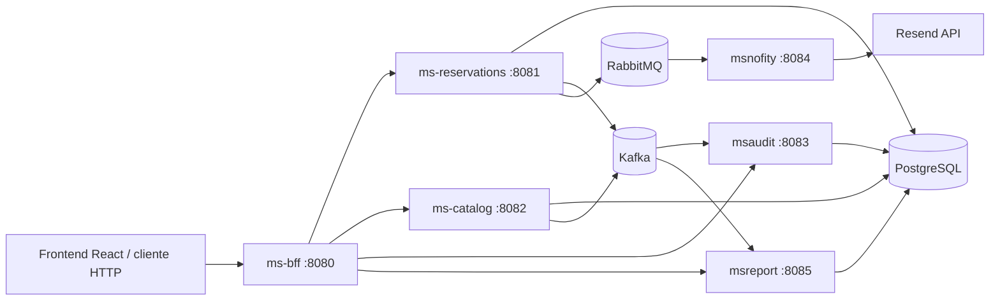

# AndesStay

Plataforma de gestión para una red de hostales, cabañas y lodges. El proyecto centraliza el catálogo de unidades, las reservas, las notificaciones, la auditoría de eventos y los indicadores operacionales mediante una arquitectura de microservicios Spring Boot.

> Este repositorio contiene principalmente el backend. La documentación original menciona un frontend React alojado en Azure y un AWS API Gateway, pero esos componentes no están incluidos en este workspace.

## Arquitectura



### Servicios

| Servicio | Puerto | Responsabilidad |
| --- | ---: | --- |
| `ms-bff` | `8080` | Entrada HTTP para el cliente, autenticación JWT y agregación/proxy hacia los microservicios. |
| `ms-reservations` | `8081` | Crea, consulta y actualiza reservas; valida disponibilidad; publica eventos y comandos. |
| `ms-catalog` | `8082` | Administra unidades, tipos de alojamiento, disponibilidad y datos del catálogo. |
| `msaudit` | `8083` | Consume eventos de auditoría desde Kafka y los persiste en `audit_events`. |
| `msnofity` | `8084` | Consume comandos RabbitMQ para email, housekeeping y vouchers. El nombre del módulo conserva la grafía actual `msnofity`. |
| `msreport` | `8085` | Consume eventos de reservas desde Kafka, los persiste y calcula KPIs. |
| PostgreSQL | `5433` externo / `5432` Docker | Base de datos compartida `andesstay_db`. |
| Kafka | `9092` externo / `29092` Docker | Event streaming para reservas, catálogo y auditoría. |
| RabbitMQ | `5672` | Mensajería de comandos; la consola de administración está en `15672`. |

Todos los servicios Java usan Maven y Spring Boot. Los Dockerfiles usan Eclipse Temurin 21 para ejecutar las aplicaciones.

## Flujo principal de una reserva

1. El cliente llama a `ms-bff` con un token JWT.
2. El BFF valida el token mediante el issuer configurado y reenvía la operación al microservicio correspondiente.
3. `ms-reservations` valida la unidad contra `ms-catalog` y persiste la reserva en PostgreSQL.
4. La reserva publica eventos Kafka en `reservations.events` y `audit.timeline`.
5. `msreport` consume `reservations.events` para alimentar reportes y KPIs.
6. `msaudit` consume `audit.timeline` y guarda la trazabilidad del actor, evento y agregado.
7. Al confirmar una reserva, `ms-reservations` publica comandos RabbitMQ para email, housekeeping y generación del voucher.
8. `msnofity` consume esos comandos y ejecuta la acción correspondiente.

Las transiciones a `CHECKIN_PENDIENTE` o `EN_ESTADIA` requieren que la reserva haya sido confirmada previamente. Las reservas canceladas son las únicas que pueden eliminarse.

## Kafka

Kafka se utiliza para eventos de dominio que pueden ser consumidos por varios servicios de forma independiente. Los productores serializan el valor como JSON y usan el identificador de la entidad como clave.

### Topics

| Topic | Productor | Consumidor | Uso |
| --- | --- | --- | --- |
| `reservations.events` | `ms-reservations` | `msreport` (`report-group`) | Eventos `RESERVATION_CREATED` y `RESERVATION_STATUS_UPDATED`. |
| `audit.timeline` | `ms-reservations`, `ms-catalog` | `msaudit` (`audit-group`) | Auditoría de reservas y unidades. |
| `catalog.events` | `ms-catalog` | No se observa un consumidor en el código actual | Eventos `UNIT_CREATED`, `UNIT_UPDATED` y `UNIT_DELETED`. |

Un evento de reserva contiene, entre otros campos, `eventType`, `reservationId`, `unitId`, `guestId`, `status`, fechas, `actor` y `timestamp`. Un evento de catálogo contiene `eventType`, `unitId`, nombre, tipo, ciudad, disponibilidad, actor y timestamp.

### Cómo funciona el consumo

- `msaudit` escucha `audit.timeline` con el grupo `audit-group`, interpreta el JSON y guarda el payload completo.
- `msreport` escucha `reservations.events` con el grupo `report-group` y guarda cada evento para calcular sus indicadores.
- Los grupos de consumidores permiten que auditoría y reportes reciban sus propias copias lógicas de los eventos.
- El broker local se ejecuta como un nodo Kafka combinado broker/controller, con replicación 1 y retención configurada de 24 horas o 1 GB.

## RabbitMQ

RabbitMQ es el broker de mensajería asíncrona utilizado para enviar **comandos de trabajo** entre microservicios. Un productor publica un mensaje y el broker decide a qué cola dirigirlo; el consumidor procesa el mensaje cuando está disponible. Esto desacopla la operación de reservas de tareas secundarias como enviar un email, crear una tarea de housekeeping o generar un voucher.

En este proyecto RabbitMQ no reemplaza a Kafka:

| Tecnología | Papel en AndesStay |
| --- | --- |
| RabbitMQ | Comandos dirigidos a una acción concreta y normalmente a un único consumidor lógico. |
| Kafka | Eventos de dominio y auditoría que pueden ser consumidos por varios grupos de consumidores. |

### Conceptos usados

- **Producer**: aplicación que publica el mensaje. En este caso, `ms-reservations`.
- **Exchange**: punto de entrada que recibe el mensaje y lo enruta; el productor no publica directamente en una cola.
- **Routing key**: clave que el exchange compara con los bindings para decidir la cola destino.
- **Queue**: almacenamiento temporal duradero del mensaje hasta que un consumidor lo procesa.
- **Consumer**: aplicación que escucha una cola. En este caso, `msnofity` mediante `@RabbitListener`.
- **Binding**: relación entre un exchange, una cola y una routing key.
- **DLX/DLQ**: dead-letter exchange y dead-letter queue; reciben mensajes que no pudieron procesarse.

### Topología real

El exchange principal es de tipo `direct`: la routing key debe coincidir exactamente con el binding de la cola. Las colas son durables, por lo que RabbitMQ conserva su definición y los mensajes pendientes ante un reinicio del broker, según las propiedades de entrega del mensaje.

| Exchange | Cola principal | Routing key | Consumidor | Acción |
| --- | --- | --- | --- | --- |
| `cmd.direct` | `q.cmd.email` | `email.send` | `msnofity` | Enviar email al huésped. |
| `cmd.direct` | `q.cmd.housekeeping` | `housekeeping.ticket` | `msnofity` | Crear ticket de preparación de habitación. |
| `cmd.direct` | `q.cmd.voucher` | `voucher.gen` | `msnofity` | Generar voucher de reserva. |
| `cmd.dead.dlx` | `q.cmd.email.dlq` | `q.cmd.email.dlq` | Sin consumidor de negocio | Mensajes fallidos de email. |
| `cmd.dead.dlx` | `q.cmd.housekeeping.dlq` | `q.cmd.housekeeping.dlq` | Sin consumidor de negocio | Mensajes fallidos de housekeeping. |
| `cmd.dead.dlx` | `q.cmd.voucher.dlq` | `q.cmd.voucher.dlq` | Sin consumidor de negocio | Mensajes fallidos de vouchers. |

Las colas principales tienen los argumentos `x-dead-letter-exchange=cmd.dead.dlx` y una routing key de dead letter con el sufijo `.dlq`. La topología se declara en `ms-reservations` y también en `msnofity`, lo que permite que cualquiera de los dos servicios declare los recursos al arrancar. Las definiciones deben mantenerse compatibles.

Aunque `ms-catalog` incluye `spring-boot-starter-amqp` y configuración de conexión, no tiene un productor, consumidor ni una configuración de colas RabbitMQ activa en el código actual. Por tanto, su relación actual con RabbitMQ es solo preparatoria.

### Flujo de una reserva

1. El cliente solicita una operación a través de `ms-bff`.
2. `ms-reservations` valida y guarda la reserva en PostgreSQL.
3. Al crear una reserva, publica un comando `EMAIL_SEND` solo cuando `notifications.email.enabled=true`. El valor predeterminado es `false`.
4. Al cambiar el estado a `CONFIRMADA`, publica un comando `HOUSEKEEPING_TICKET` y otro `VOUCHER_GEN`. También publica el email de confirmación si las notificaciones están habilitadas.
5. `RabbitTemplate.convertAndSend()` envía cada envoltorio al exchange `cmd.direct` con su routing key.
6. RabbitMQ encuentra el binding correspondiente y encola el mensaje.
7. `msnofity` recibe el mensaje con `@RabbitListener`, lee el JSON y ejecuta el servicio asociado.
8. Si el procesamiento falla y el mensaje es rechazado, `default-requeue-rejected=false` evita el reintento automático; el mensaje puede ser enviado a la DLQ configurada.

### Formato de los mensajes

Todos los comandos usan un envoltorio JSON con estos campos:

```json
{
    "eventId": "identificador-unico",
    "type": "HOUSEKEEPING_TICKET",
    "timestamp": 1710000000000,
    "traceId": "traza-unica",
    "correlationId": "RES-123",
    "payload": {}
}
```

`eventId` y `timestamp` se generan por defecto en `ms-reservations`; `traceId` identifica la publicación y `correlationId` relaciona el comando con la reserva. El contenido de `payload` depende del comando:

| `type` | Payload principal | Resultado actual en `msnofity` |
| --- | --- | --- |
| `EMAIL_SEND` | `email`, `subject`, `body` | Llama a Resend mediante `https://api.resend.com/emails`. |
| `HOUSEKEEPING_TICKET` | `unitId`, `detail` | Registra el ticket en los logs; aún no lo persiste ni lo envía a otro servicio. |
| `VOUCHER_GEN` | `reservationId`, `customerEmail`, `voucherCode`, `amount` | Registra la generación en los logs; aún no crea un voucher persistente. |

El consumidor de email también contempla el tipo `WEBPUSH`, pero actualmente solo lo registra en logs y el productor de reservas no publica ese comando.

### Microservicios y código relacionado

- `backend/ms-reservations`: dependencia `spring-boot-starter-amqp`, configuración de exchanges/colas/bindings en `RabbitMQConfig` y publicación en `RabbitMQPublisher`. `ReservationService` decide cuándo publicar.
- `backend/msnofity`: conexión al broker en `application.properties`, declaración de la topología y consumo en `NotificationListener`. Los servicios `NotificationService`, `HousekeepingService` y `VoucherService` ejecutan las acciones.
- `backend/ms-catalog`: tiene la dependencia AMQP y propiedades de conexión, pero actualmente no usa RabbitMQ funcionalmente.
- `docker-compose.messaging.yml`: inicia el broker con la imagen `rabbitmq:3-management`.
- `docker-compose.yml`: conecta `ms-reservations` y `msnofity` con el hostname Docker `rabbitmq`.

### Configuración y ejecución

RabbitMQ se ejecuta como contenedor con:

| Parámetro | Valor Docker | Valor local predeterminado |
| --- | --- | --- |
| Host | `rabbitmq` | `localhost` |
| Puerto AMQP | `5672` | `5672` |
| Usuario | `guest` | `guest` |
| Contraseña | `guest` | `guest` |
| Consola de administración | `http://localhost:15672` | `guest` / `guest` |

Para levantarlo junto con Kafka:

```powershell
docker compose -f docker-compose.messaging.yml up -d
```

Para levantar la aplicación completa, ejecutar después:

```powershell
docker compose up -d --build
```

En Docker, `ms-reservations` usa `SPRING_RABBITMQ_HOST=rabbitmq` y `SPRING_RABBITMQ_PORT=5672`; `msnofity` usa `RABBITMQ_HOST=rabbitmq`, `RABBITMQ_PORT=5672`, `RABBITMQ_USER` y `RABBITMQ_PASSWORD`. Ejecutando los servicios fuera de Docker, la conexión local usa `localhost:5672`.

### Verificación y diagnóstico

1. Abrir `http://localhost:15672` y revisar que existan `cmd.direct`, las tres colas principales y las DLQ.
2. Crear una reserva y comprobar que `ms-reservations` registra la publicación solo si corresponde al estado/configuración.
3. Confirmar una reserva y revisar los logs de `msnofity` para las rutas `q.cmd.housekeeping` y `q.cmd.voucher`.
4. Si el email está habilitado, configurar `RESEND_API_KEY` y `RESEND_FROM_EMAIL`; sin esas variables el consumo del email puede fallar.
5. Revisar las DLQ si una cola principal acumula mensajes o si un consumidor rechaza el procesamiento.

RabbitMQ no garantiza por sí mismo que una operación de negocio y su publicación sean atómicas: la reserva se guarda en PostgreSQL y el comando se publica después desde la misma lógica de servicio. Para producción convendría evaluar confirmaciones del publisher, reintentos controlados, consumidores idempotentes y un patrón outbox.

## API expuesta por el BFF

Todas las rutas del BFF requieren autenticación, salvo que la configuración de seguridad se modifique.

### Reservas

| Método | Ruta | Descripción |
| --- | --- | --- |
| `POST` | `/reservations` | Crear una reserva. |
| `GET` | `/reservations` | Listar reservas; admite `status`, `from` y `to`. |
| `GET` | `/reservations/{id}` | Obtener una reserva. |
| `GET` | `/reservations/by-unit/{unitId}` | Listar reservas de una unidad. |
| `PUT` | `/reservations/{id}/status` | Actualizar el estado. |
| `DELETE` | `/reservations/{id}` | Eliminar una reserva cancelada. |

### Catálogo

| Método | Ruta | Descripción |
| --- | --- | --- |
| `POST` | `/api/units` | Crear una unidad. |
| `GET` | `/api/units` | Listar unidades; admite `type` y `availability`. |
| `GET` | `/api/units/{id}` | Obtener una unidad. |
| `GET` | `/api/units/{id}/availability` | Consultar disponibilidad con `from` y `to`. |
| `PUT` | `/api/units/{id}` | Actualizar una unidad. |
| `DELETE` | `/api/units/{id}` | Eliminar una unidad. |

### Auditoría, reportes y usuario

| Método | Ruta | Descripción |
| --- | --- | --- |
| `GET` | `/audit` | Listar eventos de auditoría. |
| `GET` | `/audit/timeline/{aggregateId}` | Consultar la línea temporal de un agregado. |
| `GET` | `/reports` | Listar reportes almacenados. |
| `GET` | `/reports/kpis` | Obtener todos los KPIs. |
| `GET` | `/reports/kpis/reservations-by-hour` | Reservas agrupadas por hora. |
| `GET` | `/reports/kpis/active-occupancy` | Ocupación activa, basada en reservas `EN_ESTADIA`. |
| `GET` | `/reports/kpis/cycle-time` | Tiempo promedio entre creación y confirmación. |
| `GET` | `/api/users/me` | Obtener los datos del usuario autenticado. |

## Requisitos

- Docker Desktop con Docker Compose.
- Para ejecutar servicios fuera de Docker: JDK 17 o superior y Maven Wrapper.
- Una cuenta y API key de Resend si se desean enviar emails reales.
- Un host anunciado accesible para Kafka cuando se conecten clientes externos al contenedor.

## Configuración

El archivo `.env` de ejemplo del repositorio contiene:

```dotenv
KAFKA_HOST=kafka:29092
RABBITMQ_HOST=rabbitmq
RABBITMQ_PORT=5672
KAFKA_ADVERTISED_HOST=172.31.26.215
```

`KAFKA_ADVERTISED_HOST` debe cambiarse por la IP o DNS que usarán los clientes externos. No se debe publicar una credencial real en el repositorio. Para email, agregar por ejemplo:

```dotenv
RESEND_API_KEY=tu_api_key
RESEND_FROM_EMAIL=onboarding@resend.dev
```

Las configuraciones locales de los servicios usan PostgreSQL en `localhost:5433`, Kafka en `localhost:9092` y RabbitMQ en `localhost:5672`. Dentro de Compose, los servicios usan los nombres DNS de los contenedores.

## Ejecución con Docker Compose

Desde la raíz del repositorio:

```powershell
docker compose -f docker-compose.messaging.yml up -d
docker compose up -d --build
```

Comprobar el estado:

```powershell
docker compose -f docker-compose.messaging.yml ps
docker compose ps
```

URLs útiles:

- BFF: `http://localhost:8080`
- RabbitMQ Management: `http://localhost:15672` (`guest` / `guest`)
- PostgreSQL: `localhost:5433`
- Kafka externo: `localhost:9092`

Para detener la aplicación:

```powershell
docker compose down
docker compose -f docker-compose.messaging.yml down
```

Para conservar o eliminar los datos de PostgreSQL, recordar que `postgres_data` es un volumen de Docker. `docker compose down -v` lo elimina.

## Ejecución local de un servicio

Primero levantar las dependencias de mensajería y PostgreSQL:

```powershell
docker compose -f docker-compose.messaging.yml up -d
# PostgreSQL también puede levantarse con el compose principal:
docker compose up -d postgres-db
```

Después, desde el directorio de cada microservicio:

```powershell
cd backend/ms-bff
./mvnw.cmd spring-boot:run
```

En PowerShell, repetir el patrón cambiando el directorio por `ms-catalog`, `ms-reservations`, `msaudit`, `msnofity` o `msreport`. Los puertos son los indicados en la tabla de servicios.

## Estructura del repositorio

```text
.
├── backend/
│   ├── ms-bff/             # API Gateway/BFF reactivo
│   ├── ms-catalog/         # Catálogo de unidades
│   ├── ms-reservations/    # Reservas y publicación de eventos/comandos
│   ├── msaudit/            # Auditoría Kafka
│   ├── msnofity/           # Consumidores RabbitMQ y notificaciones
│   └── msreport/           # Reportes y KPIs Kafka
├── docs/
│   └── Arquitectura.MD
├── docker-compose.yml
├── docker-compose.messaging.yml
└── .env
```

## Observaciones del estado actual

- El BFF está preparado para proteger las rutas con JWT de Microsoft Entra External ID/Azure AD.
- El código incluye referencias a un frontend React y a un API Gateway de AWS en la documentación funcional, pero no hay código de frontend ni configuración de API Gateway en este repositorio.
- `catalog.events` tiene productor, pero no se encontró un consumidor activo en el backend.
- `msreport` almacena los eventos recibidos y calcula KPIs a partir de ellos; no es un motor de analítica externa.
- Housekeeping, web push y voucher están implementados como puntos de integración/logging, no como flujos persistidos completos.
- Conviene revisar los nombres de dead-letter routing keys de `ms-reservations` y `msnofity` antes de usar DLQ en producción, porque parte de esa topología se declara en ambos servicios.

## Desarrollo y pruebas

Cada módulo Maven tiene su propio `pom.xml`, wrapper Maven y carpeta `src/test`. Para ejecutar las pruebas de un módulo:

```powershell
cd backend/ms-reservations
./mvnw.cmd test
```

Cambiar `ms-reservations` por el módulo que se quiera validar.
